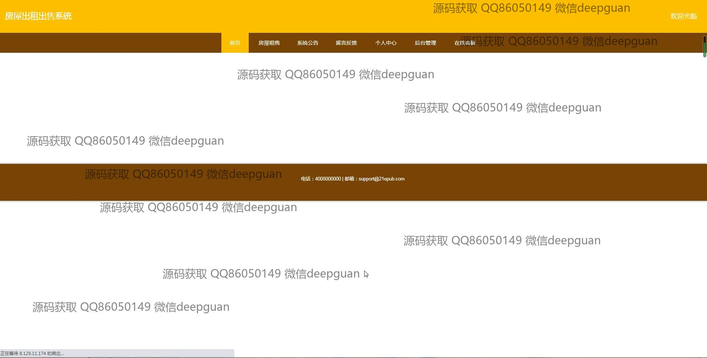
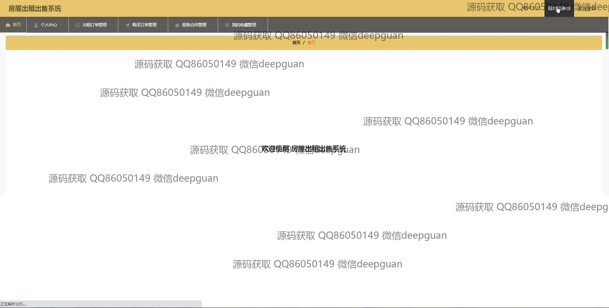

<h1 align="center">的房屋出租出售系统vue</h1>

## 简介
房屋出租出售系统：角色分为管理员、用户；提供房屋信息管理、租赁管理、销售管理、合同管理、用户反馈等功能，界面简洁直观，提高了信息管理和用户体验。    --计算机毕业设计源码；毕设源码；java毕业设计源码

## 联系方式

<h3 align="center">获取完整代码与数据库文件 + 微信：deepguan QQ: 86050149 QQ群: 783742310</h3>

<h3 align="center">可帮忙远程部署 包运行成功！提供远程部署、修改代码、设计文档指导、代码讲解等服务！</h3>

## 功能介绍（完整见运行截图）
管理员：基本功能包括登录、注册、退出系统以及切换模块；支持用户和房屋信息管理、租赁和销售订单管理、留言管理、合同管理和系统配置。管理员可查看和管理房屋详细信息，包括房屋编号、类型、价格、设施等，并支持新增、修改、删除操作。导航栏提供模块切换和系统公告发布功能，便于后台维护与运营。

用户：用户可登录、注册、退出系统，在个人中心查看和修改个人信息，管理收藏的房屋。用户可以浏览房屋出租和出售信息，查看房屋详细介绍和图片，并通过筛选、搜索功能快速定位目标房源。支持在线留言反馈以及合同上传功能，实现便捷的租赁或购买流程。

游客：无需注册即可访问网站首页，浏览房屋租售信息和推荐内容，通过系统公告了解平台动态。可使用筛选、搜索功能浏览房源信息，并查看房屋设施、地址、租售价格等详细信息。

客服：提供在线帮助和答疑服务，协助用户解决平台使用中的问题。通过导航栏功能模块支持与用户实时沟通，帮助用户完成注册、房屋查询或交易流程，同时反馈平台问题以便优化系统功能。

## 运行截图

本代码来源于网络,仅供学习参考使用!

